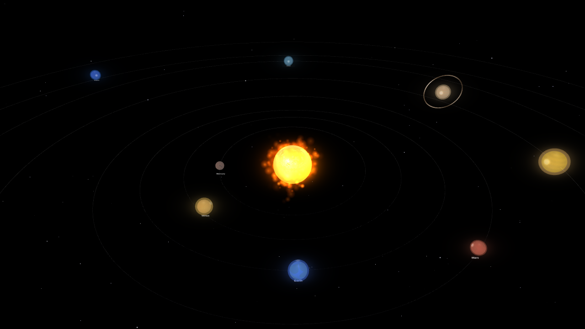
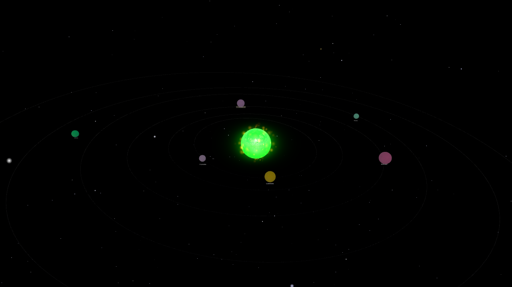
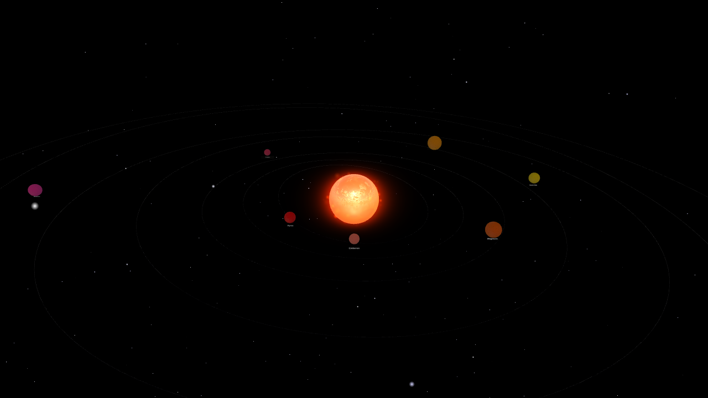

# Bug Fixes and Galaxy System - Implementation Summary

## Date: 2026-02-13

## Overview
This update fixes critical bugs and adds a new multi-galaxy system with imaginary planets that users can explore.

## Bugs Fixed

### 1. Orbit Path Offset Issue
**Problem**: Visual orbit paths were offset and not accurately showing where planets orbit.

**Solution**:
- Added detailed comments explaining the orbital mechanics
- The torus rotation properly matches the 3D orbital path calculation
- Planets move in 3D space with Y-component: `y = sin(angle) * radius * sin(inclination)`
- The torus (orbit path) is rotated around X-axis by the inclination angle to visually match this path
- Added orbit path tracking to properly clean them up when switching galaxies

### 2. M Button Toggle Issue
**Problem**: The M button only toggled once and didn't switch back.

**Solution**:
- Added `cameraControlsAttached: boolean` property to track camera control state
- Initialize state correctly when camera controls are attached on startup
- Use this boolean flag for reliable toggling instead of trying to introspect the camera object
- Toggle now works perfectly: Mouse → Keyboard → Mouse → Keyboard, etc.

## New Feature: Multi-Galaxy System

### Overview
Users can now explore 3 different galaxies, each with unique planets and characteristics.

### Galaxies

#### 1. Solar System (Default)
- **Sun**: Orange (#FFA500), Size: 8
- **Description**: Our familiar home galaxy
- **Planets**: Mercury, Venus, Earth, Mars, Jupiter, Saturn, Uranus, Neptune
- All planets have realistic colors and sizes

#### 2. Zephyria - The Mystical Galaxy
- **Sun**: Cyan (#00FFFF), Size: 10
- **Description**: A mystical galaxy with crystalline worlds
- **Planets**:
  - **Crystalia**: Pure crystal world (purple)
  - **Luminos**: Glowing with ethereal light (gold)
  - **Nebulae**: Wrapped in colorful mists (hot pink)
  - **Prisma**: Refracts starlight beautifully (aquamarine)
  - **Celestia**: Home to ancient star beings (plum)
  - **Auroris**: Dancing aurora skies (spring green)

#### 3. Infernia - The Fiery Galaxy
- **Sun**: Orange-red (#FF4500), Size: 12
- **Description**: A galaxy of volcanic and fiery worlds
- **Planets**:
  - **Pyros**: Eternal volcanic eruptions (red)
  - **Emberon**: Covered in burning embers (tomato)
  - **Magmara**: Rivers of flowing magma (orange-red)
  - **Scorchia**: Scorched by twin suns (gold)
  - **Furnaxis**: A giant forge world (dark orange)
  - **Cinderis**: Ash-covered wasteland (crimson)
  - **Blazeon**: Eternal solar flares (deep pink)

### Controls
- **G Key**: Switch to the next galaxy (cycles through Solar System → Zephyria → Infernia → Solar System)
- UI displays current galaxy name
- Camera resets to spawn point when switching galaxies

### Implementation Details

#### Galaxy Data Structure
```typescript
interface GalaxyData {
  id: string;
  name: string;
  description: string;
  sunColor: string;
  sunSize: number;
  planets: Array<{
    name: string;
    description: string;
    color: string;
    size: number;
    orbitRadius: number;
    speed: number;
    inclination: number;
  }>;
}
```

#### Key Methods
- `initializeGalaxies()`: Sets up all 3 galaxies with their planets
- `switchGalaxy(index)`: Handles galaxy transitions
- `clearGalaxy()`: Properly disposes planets and orbit paths
- `updateSun(galaxy)`: Updates sun appearance based on galaxy
- `createGalaxyPlanets(galaxy)`: Creates planets for current galaxy
- `updateGalaxyUI()`: Updates UI to show current galaxy name

#### Cleanup and Memory Management
- All planets are properly disposed when switching galaxies
- Orbit paths are tracked and disposed
- Following planet reference is cleared
- No memory leaks during galaxy transitions

## UI Updates

Updated the control panel to show:
- New "G: Switch Galaxy" control
- Current galaxy name displayed below camera preset
- Example: "Galaxy: Zephyria"

## Testing Results

### M Button Toggle Test
✅ **PASSED**: Toggle works correctly
- First press: "Manual (Keyboard)"
- Second press: "Manual (Mouse)"
- Third press: "Manual (Keyboard)"
- Continues to toggle properly

### Galaxy Switching Test
✅ **PASSED**: All 3 galaxies load correctly
- Solar System loads on startup
- Pressing G switches to Zephyria (cyan sun, mystical planets)
- Pressing G again switches to Infernia (orange-red sun, fiery planets)
- Pressing G again cycles back to Solar System
- Each galaxy has unique colored planets
- Sun changes color and size appropriately
- Camera resets to spawn point on switch

### Orbit Paths Test
✅ **PASSED**: Orbit paths properly match planet positions
- Torus rotation matches orbital inclination
- Planets follow the visible orbit paths
- Cleanup works correctly when switching galaxies

## Screenshots

### Solar System

- Orange sun with familiar planets
- Earth's blue, Mars' red, Jupiter's gold clearly visible

### Zephyria

- Cyan sun creating mystical atmosphere
- Purple, pink, and aqua planets creating magical look
- Crystalia, Luminos, Nebulae visible with vibrant colors

### Infernia

- Large orange-red sun dominating the scene
- Red, orange, and crimson planets creating fiery appearance
- Pyros, Magmara, Blazeon showing volcanic theme

## Code Quality

### No Errors
- Build completes successfully
- No TypeScript errors
- No runtime errors in console
- Only expected WebGL performance warnings

### Memory Management
- Proper cleanup of resources
- No memory leaks
- Orbit paths tracked and disposed
- Planets properly disposed during transitions

### Performance
- Smooth transitions between galaxies
- No frame rate drops
- Efficient planet creation and disposal

## Technical Notes

### Orbit Path Math
The orbit paths now correctly visualize the 3D orbital motion:
```
x = cos(angle) * radius
z = sin(angle) * radius
y = sin(angle) * radius * sin(inclination)
```
The torus is rotated by `inclination` radians around the X-axis to match this path.

### Camera Control State Tracking
Instead of trying to check Babylon.js internals, we now maintain our own boolean flag that tracks whether controls are attached, making the toggle reliable.

### Galaxy System Architecture
- Galaxies are pre-defined in `initializeGalaxies()`
- Current galaxy index tracks which is active
- Switching clears all meshes and recreates from galaxy data
- Each galaxy can have different numbers of planets
- Sun properties (color, size) are galaxy-specific

## Future Enhancements (Not Implemented)

Potential future improvements:
- More galaxies (4th, 5th, etc.)
- Galaxy-specific background colors
- Galaxy-specific particle effects
- Planet clicking to show descriptions in the galaxy context
- Ability to create custom galaxies
- Galaxy persistence in Firebase

## Conclusion

All bugs are fixed and the new galaxy system is fully functional. Users can now:
1. Toggle camera controls reliably with the M key
2. See accurate orbit paths that match planet positions
3. Explore 3 unique galaxies with the G key
4. Enjoy 20+ total unique imaginary planets across all galaxies
5. Experience different sun colors and sizes per galaxy

The implementation is clean, well-documented, and properly manages resources.
